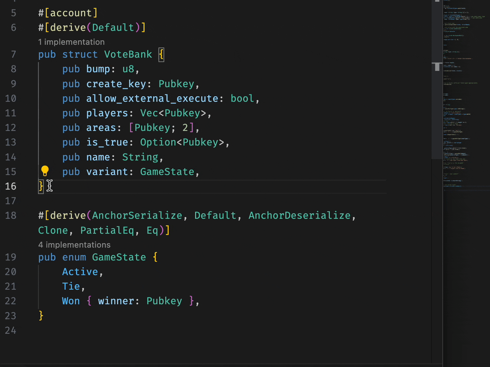

# Anchor lang Extension

An attempt to write a extension to support [Anchor lang](https://www.anchor-lang.com/) dev in VS-code.

---

This for now calculate a size of an anchor account struct and creates a impl block as shown below

---

## Expected Features

- [ ] Find Space for a account struct
  - [x] simple types 
  - [ ] string
  - [ ] enums
- [ ] Code Completion
- [ ] Open issues and request for features..
